# SketchUp Extension UX Guidelines

The purpose of these guidelines is to help developers design extensions that
closer align with SketchUp and to create an improved and unified experience for
the end user.

Often it isn’t more work for developers to create a better user experience once
you know how. These guidelines along with code examples are intended to even
make it easier.

You may choose to ignore these guidelines. For instance, for an internal tool,
discoverability can be sacrificed in favor of efficiency. For a technically
complex extension you may want to use a language slightly different to that of
SketchUp. If you already have a strong brand identity, feel free to use it.
However, we recommend that you familiarize yourself with the guidelines and ask
yourself why when ignoring them.

## General principles

### Language and Tone

Use a friendly, down to earth, not too technical, yet precise language.
SketchUp uses self-descriptive English compound words like “Endpoint” instead of
the technical Latin word “Vertex”. SketchUp’s original slogan was “3D for the
rest of us”, an active stance against the overly technical programs.

### Respect the Undo Stack

Undo is a key usability feature allowing the user to experiment with their
design. Preventing the user from undoing or redoing as expected can lead to data
loss.

One user action should map to one undo step, and vice versa.
Wrap multiple model changes caused by the same user action into a single
operation using `Sketchup::Model#start_operation` and
`Sketchup::Model#commit_operation`.

Don't silently perform changes to the model that are not directly caused by a
user action. For instance, don't write attributes on model load or when your UI
is shown, only when the user deliberately makes a change to the model.

Bad:

```ruby
model = Sketchup.active_model
points = [
  Geom::Point3d.new(0, 0, 0),
  Geom::Point3d.new(1.m, 0, 0),
  Geom::Point3d.new(1.m, 1.m, 0),
  Geom::Point3d.new(0, 1.m, 0)
]
face = model.active_entities.add_face(points)
# Make sure face front side is directed upwards.
face.reverse! unless face.normal.samedirection?(Z_AXIS)
face.pushpull(1.m)
```

Good:

```ruby
model = Sketchup.active_model
model.start_operation("Draw Cube", true)
points = [
  Geom::Point3d.new(0, 0, 0),
  Geom::Point3d.new(1.m, 0, 0),
  Geom::Point3d.new(1.m, 1.m, 0),
  Geom::Point3d.new(0, 1.m, 0)
]
face = model.active_entities.add_face(points)
# Make sure face front side is directed upwards.
face.reverse! unless face.normal.samedirection?(Z_AXIS)
face.pushpull(1.m)
model.commit_operation
```

### Honor Group's Uniqueness

Most SketchUp users probably think of groups as unique objects.
However, when a group is copied in SketchUp, the copy shares a definition with
the original. Only once the user enters the group to edit it, it is silently
made unique.

For a consistent behavior, silently make groups unique before editing them with
the APIs.

### Honor Lock State

Don’t modify entities that are locked. The user has locked the entities to
prevent accidental editing.

Bad:

`do_stuff(Sketchup.active_model.selection)`

Good:

`do_stuff(Sketchup.active_model.selection.reject(&:locked?))`

If your extension edits the contents of a group or component, not just the
container from the outside, remember to also check for additional instances
outside the selection as these would also be affected.

Exception:
Eneroth Hide Locked allows to hide and unhide locked groups and components.
Since this is the one and only purpose of the extension, it doesn’t surprise the
user. Accidentally hiding and unhiding is also much easier to correct than an
accidental move or delete.

### Use SketchUp Lengths

Use SketchUp’s own length parsing for user input, and SketchUp’s own formatting
for displaying lengths to the user. This makes the extension automatically
support all length unit SketchUp supports with no extra work, as well as
following the unit settings for individual models.

Bad:
```ruby
default = "100"
label = "Length (mm)"
title = "Enter Length"
result = UI.inputbox([label], [default], title)
return unless result
length = result[0].to_f.mm
```

Good:
```ruby
default = 100.mm
label = "Length"
title = "Enter Length"
result = UI.inputbox([label], [default], title)
return unless result
length = result[0].to_l
```

### Convey Missing License

When an extension isn’t licensed, make sure its menus and toolbars are still
showing. Show a message that the extension isn’t licensed when the user tries to
interact with it.

If the toolbars and menus are missing, it appears to the user as an installation
issue, not a licensing issue. If an error message is shown only when SketchUp
starts, the user may have forgotten about it when it is time to use the
extension. This is also distracting when you want to use SketchUp for anything
other than that particular extension.

Bad:

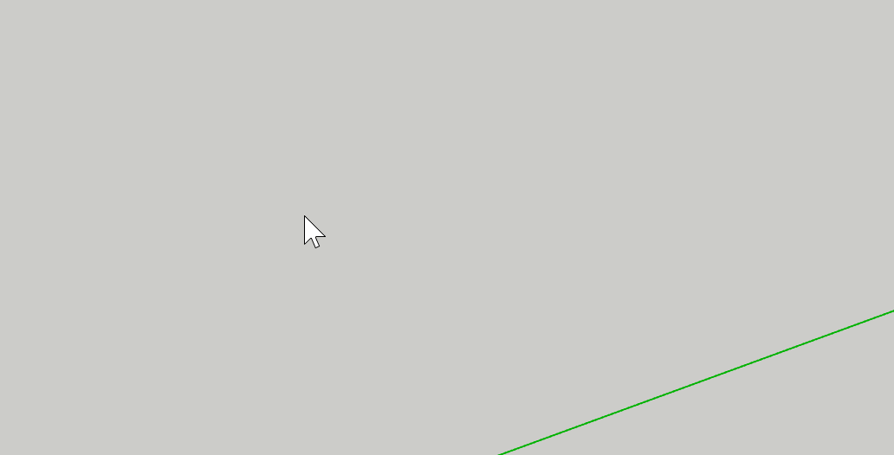

Good:

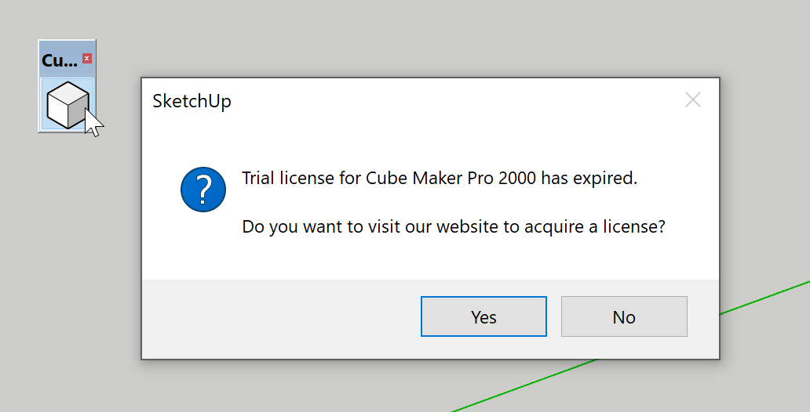

### Link Dialog to Selection

If you can open a UI to edit the properties of a selected object, it feels
natural for that UI to stay relevant when the selection changes. A UI "sticking"
to an object that has been deselected both risks the wrong object being
modified, and can have a subtle feel of being broken.

Bad: [Eneroth Attribute Editor](https://extensions.sketchup.com/extension/8b54e07c-55ea-4870-9b09-d1db0bdcc23a/eneroth-attribute-editor)

Good: Entity Info \
Good: [Aerilius Attribute Inspector](https://github.com/Aerilius/sketchup-attribute-inspector) \
Good: [HtmlDialog examples](https://github.com/SketchUp/htmldialog-examples) (Example 5 and later)


### Question Your Warnings

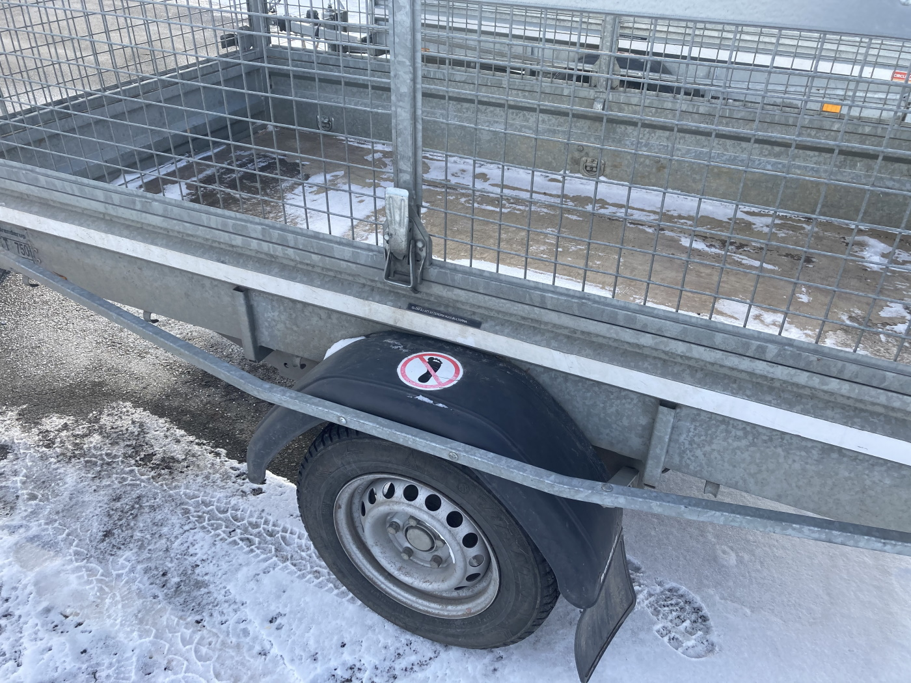

_If you already know I want to stand here for better reach, why not just design
it to support my body weight, instead of slapping a sticker on it?_

If you feel the need to warn the user about interacting with your extension a
certain way, consider instead making the extension behave the way the user
expects by allowing such interaction. For instance, instead of writing "WARNING:
Don't use SketchUp's move tool to move walls'', consider making your walls
support the Move tool. When phrasing such a warning you have already identified
that the Move tool is a natural way to move your walls.

### Don't Scream

If an element is very important, it can be tempting to style it to be more
prominent. If several elements are important, this can lead to them all shouting
for attention with size and bright colors. Consider the opposite route and
instead make the less important elements less prominent, or tuck them away
behind progressive disclosure or separate windows.


### Consider Using Modus for Your Dialogs

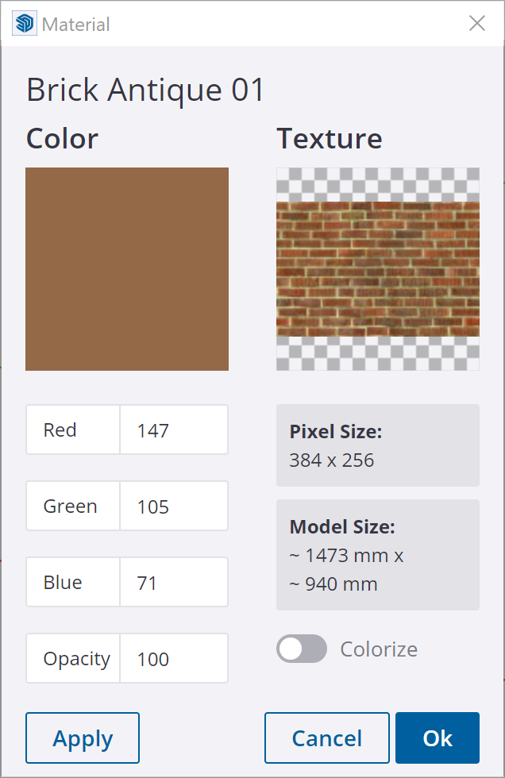

If you don't have strong branding in your extension dialogs already, why not use
that of SketchUp? Modus is the UI framework used by SketchUp and various other
Trimble products, and helps make your extension feel grounded in SketchUp.

TODO: Add link to our usage guide.

## Menus and Toolbars

### Prefer the Extension Menu

Generally the Extension menu is where users will expect to find functionality
added by an extension, not Tools, Window or other menus.

Exception: When an extension adds commands that closely relate to native
commands in other menus, it may be good to use the same menu. See
[Dan Rathbun’s Text & Dimension toggles](https://forums.sketchup.com/t/hide-all-texts-from-view-menu/38746/5?u=ene_su).

### Use Submenus

When adding more than one entry to a menu, group them in a submenu. This
prevents the menu from getting impractically long when many extensions are
installed.

### Don’t Abuse the Context Menu

The context menu (right click menu) is intended for actions related to the
object you click. It is not a shortcut for quick access to common actions. This
menu is heavily used and experienced users rely on muscle memory to click
entries without reading the text.

It can also be a good idea to add a setting for your extension whether it should
add entries to the context menu or not.

### Have Menu Entries for All Commands

As of now, SketchUp users can only set up shortcuts to menus, not to toolbars.
To help frequent users speed up their work, make sure all commands you add to
toolbars are also added to menus. Menus are also useful for infrequent users of
your extension that don't want to waste space with a visible toolbar.

Typically add a submenu to Extensions, named after your extension. The same
`UI::Command` object can be used for both the toolbar and menu.

### Minimize Toolbar Size

A SketchUp user may have 10, 50 or even 100 extensions installed. Avoid making
the toolbar take up too much space on the screen. Instead of using two commands
for enabling and disabling some property, use a single command for toggling it.
Rarely used commands such as Help or About can typically be dispelled to the
extension’s menu alone.

Advanced extensions can also have multiple toolbars, e.g. one for the typical
user and another one for an advanced task such as content creation.

### Omit Extension Version Number

Sometimes developers include the extension version number in the menu entries or
toolbar titles.This causes shortcuts and stored toolbar positions to break when
the extension is updated and the number changes. Don't include the version
number in menu entries or toolbar titles.

Exception: Sometimes when an extension is rewritten and published as a new
separate extension, it gets a number added to its name. This is technically not
a version number as it is now a different extension. E.g. CleanUp³.

### Capitalization

Use title case for command titles and sentence case for command status bar
texts/descriptions. In English title case, all words are capitalized except for
small words like “and”, “to” and “of”.

When localizing an extension, beware that capitalization rules differ between
languages. For instance Swedish only capitalizes the first word (and proper
nouns) also in title case.

### Tooltips/Descriptions

Add a tooltip/status bar text describing in a full sentence what a command does.

Bad: Sandbox Tools

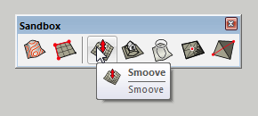

Good: Rectangle Tool

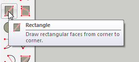

### Use of Separators

Never add separators to the Extensions menu. This makes unrelated entries appear
grouped together. For grouping your extension’s entries in the Extensions menu,
always use a submenu.

Bad:

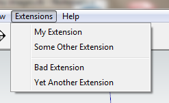

Good:

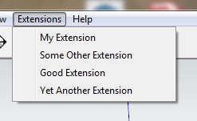

In menus other than Extensions, always add a separator before your extension.
This prevents your entries from being read as a part of an existing group.

Bad:


Good:

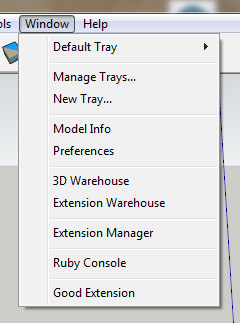

Never add a separator after your entries. It is up to the following extension to
add a separator before its entries.

Bad:

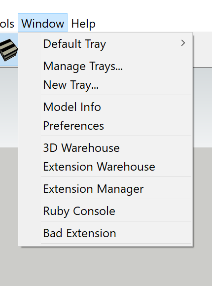 

Good:

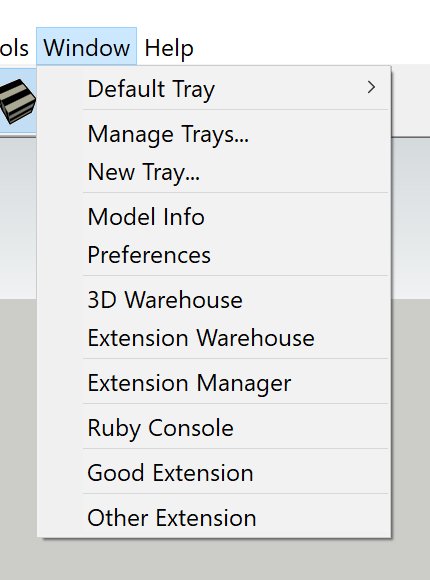

## Tools

### Only Call Tools Tools

In a wider context a tool could mean anything you use to get a job done, but in
SketchUp a tool more specifically means something that listens to mouse and/or
keyboard input (implements the [tool interface](https://ruby.sketchup.com/Sketchup/Tool.html)).
Line tool and Circle tool are tools while Make Components and Shaded With
Textures are not tools. Avoid referring to commands “tools” when they aren’t.

### Use Esc to Reset the Tool

In SketchUp, pressing Esc resets a tool to its initial state.

Good: Rectangle Tool

TODO: Check if this example can be used: https://github.com/SketchUp/sketchup-ruby-api-tutorials/tree/master/tutorials/02_custom_tool

### Don’t Add UI for Switching to Select Tool

In many programs, e.g. AutoCad and SolidWorks, pressing Esc backs you out of the
current tool and into the default tool. SketchUp has no such concept of leaving
a tool, only selecting a new tool in its place. By default spacebar is the
shortcut for activating the Select tool. No additional way to do so is needed
within your tool.

### Keep Tool Selected

When an operation is done, reset the tool to its initial state and allow the
user to use it again. Do not switch to the Select tool or other tools once an
operation is completed. 

Good: Rectangle Tool

Exception: Axes Tool is almost never used more than once at a time and
reactivates the previous tool when done. The same applies to
[Solar North](https://github.com/SketchUp/solar-north).

### Highlight Active Tool in Menu/Toolbar

When a tool is selected, show its entry as checked and button as depressed in
the menus and toolbar respectively. Up to SketchUp 2015 this was done
automatically, but now needs to be actively implemented with a validation proc.

Bad: [Solar North 1.2.0](https://github.com/SketchUp/solar-north/releases/tag/1.2.0)

Good: [Solar North 2.0.0](https://github.com/SketchUp/solar-north)

### Use In-Tool Selection

If a tool requires a certain selection to be used, prefer entering a select mode
when the tool is activated without such a selection, instead of showing an error
message.

Good: Scale Tool, Move tool, Rotate tool

TODO: Add code example. Can e.g. use my Picker mix in.

### Support Tool Pre-Selection

If a tool has a stage for selecting entities, this stage can be skipped if
entities are already selected at tool activation. This prevents the need for
clicking an object again if it was already selected, but can also be used to for
additional functionality.

Good: Scale tool \
Good: Follow Me tool allowing a pre-selected rail. \
Good: Move and Rotate tool supporting input points outside of the pre-selected object \
Good: Eneroth Solid Tools allowing multi-object trim/subtract if these objects are pre-selected.

TODO: Add video?

### Use Inference and Inference Lock

When applicable, allow the user to lock a tool to the modelling axes with arrow
keys, or to planes and liens with Shift.

Bad: Eneroth Railroad System

Good: Line tool \
Good: Eneroth Scaled Tape Measure Tool

TODO: Use different steps of SU tool examples as bad and good examples. May base on Eneroth Scaled Tape Measure Tool.

### Allow both Click + Move + Click and Press + Drag + Release Style

When drawing in SketchUp, click + move + click puts less strain on the wrist and
is generally preferred, but press + drag + release feels more intuitive to some
users. By allowing both styles a tool is both ergonomic and easy to pick up.

TODO: Include in SU tool examples.

### Use Press + Drag + Release for Optional Advanced Input

In SketchUp drawing is typically done in a click + move + click fashion.
However, the initial click can be extended to a drag for additional input, e.g.
to select a rotational axis in the Rotate tool.

Bad: Circle tool, Polygon tool

Good: Rotate tool\
Good: Curic Mirror

### Convey Depth and Direction with Perspective

It can be tricky to convey 3D concepts on a 2D screen. Instead of 2D handles in
screen space, 3D handles can help convey where in space they are. A 3D circle
can convey a plane.

Good: Scale tool\
Good: Rotate tool\
Good: [Solar North](https://github.com/SketchUp/solar-north)

### Use the Status Bar

Use the status bar to express what the user can/should do with the tool, as well
as what modifier keys there are. Make sure to keep this text as brief as
possible to make it effortless to read.

Don't just state the name of the active tool; this should be conveyed from the
toolbar button state.

Bad: "Make unique tool"

Bad: "Press a component to make it unique so you can edit it without editing the other components. Shift makes all copies of this component also unique."

Good: "Select a component to make unique. Shift = Make all instances unique."

### Use the Instructor

Use the Instructor to give a slightly more in depth explanation of the tool. Include a list of the tool stages, all modifier keys and any alternate workflows flows here such a preselection and in tool selection.

Good: [Solar North](https://github.com/SketchUp/solar-north)

### Be Scale Agnostic

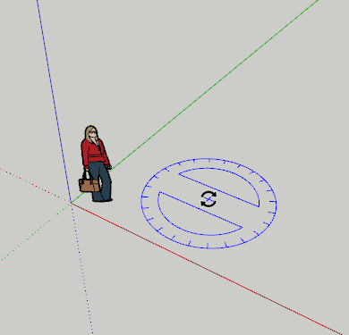 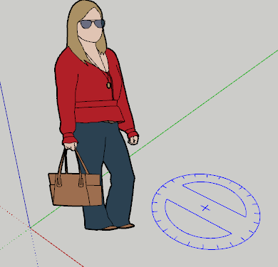 

SketchUp looks and feels the same whether you are modeling a chair or a house.
For instance, how quickly you zoom and pan is based on the distance to the
object you hover and aren’t constant speeds in space. The speed isn't the same
but feels the same, regardless of the size of the object.

Good: Zoom tool moving the camera relative to the distance to what is hovered. \
Good: Pan tool moving the camera so that the hovered object stays under the cursor. \
Good: Rotate tool protractor having the same screen size regardless of zoom level.

## Extension Presentation

### The Reader

The extension description is read by different people in different situations.
Some are under time pressure and have a specific problem to solve. Others are
just taking a stroll around the internet in a causal search for new discoveries.
With a well structured description you can appeal to both types of readers.

### The Important What

What is the extension doing? What problem does it solve on a higher level? If
this isn't absolutely clear from the first few sentences, chances are the user
will continue looking for another extension.

### The Forgotten Why

Too often it is left out why a certain functionality would be useful. Provide an
example or two, and chances are a user that didn't have a specific problem to
solve will still remember the example for the future, or maybe come up with a
new idea for a project.

### The Overrated How

Often it isn't very relevant in an extension description exactly how an
extension is used. What each button does should be conveyed from its icon, name
and hover description. What modifier keys there are in a tool should be conveyed
by the status text and instructor.

If such information is provided also in the presentation, make sure to have it
below the what and the why.

### The Courteous Where

If the user chooses to install the extension, it is courtesy to mention where in
SketchUp the extension can be found, E.g. in "Extensions > Solar North". This is
especially true for extensions that have no toolbar but must be located from a
menu. Keep this to the end of the description.

### Avoid Excessive Formatting

Formatting such as headers, lists and line breaks can be good to structure the
text. However, excessive formatting adds noise that makes the text harder to
focus on and to read. Use formatting to convey information, and avoid formatting
that is purely cosmetic.
